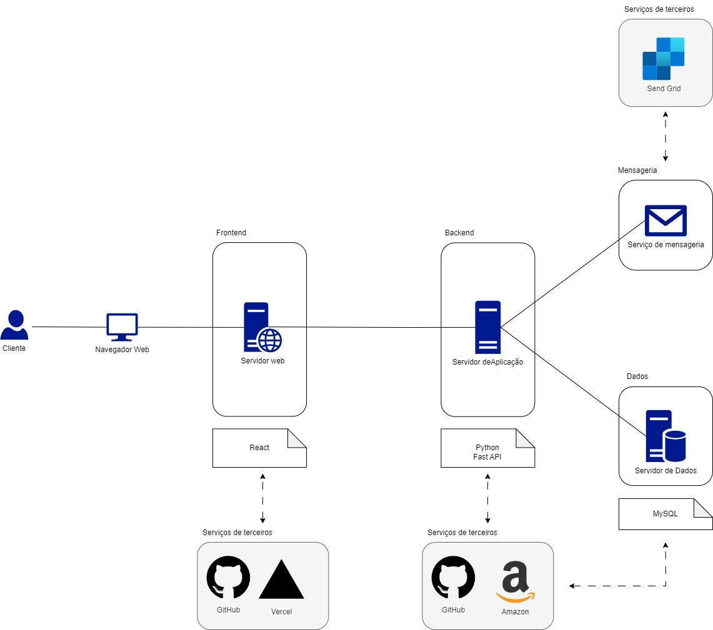

# Back-End: Sistema de Monitoramento de Alunos do PGCOMP-UFBA

Projeto da disciplina: MATE85 - Tópicos em Sistemas de Informação e Web I

## Tabela de Conteúdos:

- [Sobre o Projeto](#sobre-o-projeto)
- [Autores](#autores)
- [Linguagem e Tecnologias](#linguagem-e-tecnologias)
- [Arquitetura do Back-End](#arquitetura-do-back-end)
- [Getting Started](#getting-started)
- [Links](#links)

## Sobre o Projeto:

Repositório com o back-end da aplicação do sistema de monitoramento de alunos do PGCOMP-UFBA — projeto relacionado à disciplina Tópicos em Sistemas de Informação Web I.

### Autores:

- Alex Lima
- Izak Alves Gama
- Jean Loui Bernard
- Mário Augusto
- Pedro Harzer
- Rafael Costa
- Tauane Sales

### Linguagem e Tecnologias:

- Python 3
- FastAPI
- SendGrid

### [Arquitetura do Back-End](./arquitetura_sistema.jpg)

A imagem abaixo mostra a arquitetura do lado back-end da aplicação.

### Tutorial de Instalação e Execução da Aplicação
Acesse o documento [aqui](https://docs.google.com/document/d/1YcuaeqOL8hw_qZtkXWW5xiz_TFoLFvJ-SSdYZ21bH0w/edit) para saber como configurar, instalar e executar a aplicação.

### Links:

- [Aplicação em Produção](https://back.mate85.tauane.artadevs.tech/)
- [Gestão do Projeto (Jira)](https://taysales6.atlassian.net/jira/software/projects/KAN/boards/1?atlOrigin=eyJpIjoiNTY5MGQyZmVhOTMwNDJiYjhkMmJjY2NjNjhmYWYwYmIiLCJwIjoiaiJ9)
- [Getting Started](./docs/getting-started.md)
- [Repositório do Front-End do Projeto](https://github.com/tauanesales/FRONT-MATE85-Topicos-em-sistemas-de-informacao-e-web-i)
